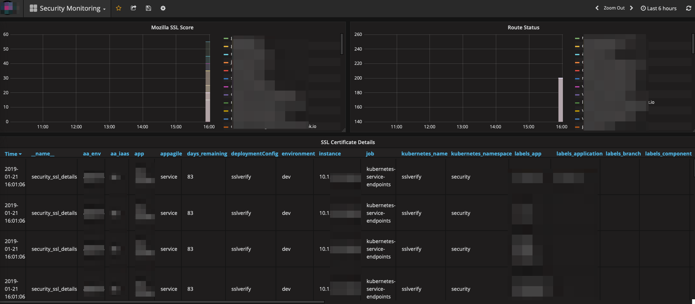

# Monitor OpenShift Routes in Prometheus

[](LICENSE)
[](https://travis-ci.org/toolisticon/oc-routes-prometheus-exporter)
[](https://jenkins.holisticon.de/blue/organizations/jenkins/toolisticon%2Foc-routes-prometheus-exporter/branches/)
[](https://hub.docker.com/r/toolisticon/oc-routes-prometheus-exporter/)
[](https://badge.fury.io/js/%40toolisticon%2Foc-routes-prometheus-exporter)
[](https://hub.docker.com/r/toolisticon/oc-routes-prometheus-exporter/)
[](https://hub.docker.com/r/toolisticon/oc-routes-prometheus-exporter/)

> Still **WIP**


## Usage

This nodejs application assumes that the container in which the application is running has already a valid OpenShift session. The entrypoint will try to autologin via a service account.
So all you need is to create a image with the desired openschift installed:


```
FROM toolisticon/oc-routes-prometheus-exporter:latest

ENV SUMMARY="openshift-ssl-verify runtime image"
ENV DESCRIPTION="openshift-ssl-verify runtime"
ENV TZ="Europe/Berlin"
ENV OPENSHIFT_VERSION=3.10.0
ENV NVM_DIR="$HOME/.nvm"

LABEL summary="$SUMMARY" \
      description="$DESCRIPTION" \
      io.k8s.description="$DESCRIPTION" \
      io.k8s.display-name="sslverify" \
      io.openshift.tags="security,sslverify,platform" \
      com.redhat.component="sslverify-container"

USER 0

# Update
RUN yum -y update && yum clean all && rm -rf /var/cache/yum

# Install oc and jq
RUN yum -y install centos-release-openshift-origin && \
    yum -y install origin-clients-${OPENSHIFT_VERSION} && \
    yum -y install epel-release && yum -y install jq

USER 1000
```

The pod should start with this output:
```
Now using node v8.15.0 (npm v6.4.1)
[2019-01-18T14:59:04.929Z] prometheus-exporter listening at 9000
[2019-01-18T15:00:00.005Z] Triggering check
[2019-01-18T15:00:00.006Z] Start reading route information.
[2019-01-18T15:00:05.133Z] Start triggering scan.
```
The metrics are available via via localhost:9000 on the pod:

```
security_ssl_mozilla_observatory{algorithm_version="2",end_time="1547804767000",grade="D",hidden="false",likelihood_indicator="MEDIUM",response_headers_cache-control="no-cache, no-store, max-age=0, must-revalidate",response_headers_content-type="996616800000",response_headers_date="1547804765000",response_headers_expires="946681200000",response_headers_pragma="no-cache",response_headers_set-cookie="556448b8f044ea9c0fe56ec8eabb3577=6dda08a289298b570c8daa5a12e94408; path=/; HttpOnly; Secure",response_headers_transfer-encoding="chunked",response_headers_x-application-context="193033926000000",response_headers_x-content-type-options="nosniff",response_headers_x-xss-protection="1; mode=block",scan_id="9783173",score="35",start_time="1547804762000",state="FINISHED",status_code="404",tests_failed="3",tests_passed="9",tests_quantity="12",url="sub.domain-sample.com",security_ssl_mozilla_observatory{algorithm_version="2",end_time="1547804767000",grade="D",hidden="false",likelihood_indicator="MEDIUM",response_headers_cache-control="no-cache, no-store, max-age=0, must-revalidate",response_headers_content-type="996616800000",response_headers_date="1547804765000",response_headers_expires="946681200000",response_headers_pragma="no-cache",response_headers_set-cookie="556448b8f044ea9c0fe56ec8eabb3577=6dda08a289298b570c8daa5a12e94408; path=/; HttpOnly; Secure",response_headers_transfer-encoding="chunked",response_headers_x-application-context="193033926000000",response_headers_x-content-type-options="nosniff",response_headers_x-xss-protection="1; mode=block",scan_id="9783173",score="35",start_time="1547804762000",state="FINISHED",status_code="404",tests_failed="3",tests_passed="9",tests_quantity="12",url="sub1.domain-sample.com",} 35
security_ssl_mozilla_observatory{algorithm_version="2",end_time="1547804767000",grade="D",hidden="false",likelihood_indicator="MEDIUM",response_headers_cache-control="no-cache, no-store, max-age=0, must-revalidate",response_headers_content-type="996616800000",response_headers_date="1547804765000",response_headers_expires="946681200000",response_headers_pragma="no-cache",response_headers_set-cookie="556448b8f044ea9c0fe56ec8eabb3577=6dda08a289298b570c8daa5a12e94408; path=/; HttpOnly; Secure",response_headers_transfer-encoding="chunked",response_headers_x-application-context="193033926000000",response_headers_x-content-type-options="nosniff",response_headers_x-xss-protection="1; mode=block",scan_id="9783173",score="35",start_time="1547804762000",state="FINISHED",status_code="404",tests_failed="3",tests_passed="9",tests_quantity="12",url="sub.domain-sample.com",security_ssl_mozilla_observatory{algorithm_version="2",end_time="1547804767000",grade="D",hidden="false",likelihood_indicator="MEDIUM",response_headers_cache-control="no-cache, no-store, max-age=0, must-revalidate",response_headers_content-type="996616800000",response_headers_date="1547804765000",response_headers_expires="946681200000",response_headers_pragma="no-cache",response_headers_set-cookie="556448b8f044ea9c0fe56ec8eabb3577=6dda08a289298b570c8daa5a12e94408; path=/; HttpOnly; Secure",response_headers_transfer-encoding="chunked",response_headers_x-application-context="193033926000000",response_headers_x-content-type-options="nosniff",response_headers_x-xss-protection="1; mode=block",scan_id="9783173",score="35",start_time="1547804762000",state="FINISHED",status_code="404",tests_failed="3",tests_passed="9",tests_quantity="12",url="sub2.domain-sample.com",} 35
```

If you want to complete use 

## Configuration

You can override the config via environment variables:
```
   SERVER_PORT: // set desired port for prometheus endpoint, defaults to 9000
   CRON: // set cron pattern, default is '0 0 * * * *',
   LOG_LEVEL: // set log level, default is 'ERROR' ('INFO' outputs details info)
```

You'll find a Grafana Dashboard [here](https://grafana.com/dashboards/9693):



## Troubleshooting

If the service account does not have access to projects, you will see this message
```
Logged into "https://...:8443" as "system:serviceaccount:security:sslverify" using the token provided.

You don't have any projects. Contact your system administrator to request a project.
Welcome! See 'oc help' to get started.
```

## Development

### Debug

To debug run the following command:
```
node --inspect-brk index.js
```

To debug unit tests:

```
npm run test:debug
```
